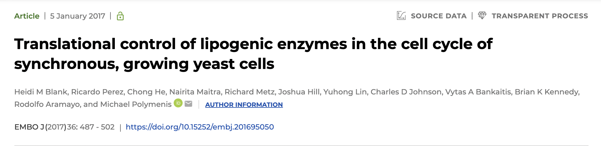

Learning objectives: \* Download and inspect data using R \* Learn how to use Tidyverse functions \*
Explore data in a scientifically motivated way \* Organize and manipulate data in preparation for
summary and visualization

```{r setup, include=FALSE}
knitr::opts_chunk$set(echo = TRUE)
```

# Data Exploration and Clean-Up

Introduce self.

Points to go through 1. Utilize green-red sticky 2. HackMD 3. Resources, Kayla's printed cheat
sheets 4. Survey

The first hald of this morning, we'll go through the package called `Tidyverse` which you all should
have installed as part of the lesson yesterday. Red sticky if you don't have `Tidyverse` installed.

## Data structure

### Refresher on Data Types

We will do a quick refresher on data types in R which Krista has touched on a little bit yesterday.
These are basically categories of values that computers can read and interpret in different ways. If
you know other programming languages, these categories tend to overlap, though might have different
names.

#### 1. Numeric

Basically, numbers that we know very well. You can perform mathematical operations on them. The
types of numeric values you are going to encounter the most are:

1a. "Double" - represent real numbers (whole numbers and decimals). It is the default value for
whole numbers.

> Reminder about shortcut for making new chunk - `cmd + option + i`

```{r}
typeof(10)
typeof(20.24)
typeof(pi) # R has built-in constants, e.g., pi
```

1b. "Integer" - represent whole numbers only.

Whole numbers are defaulted to `double`. You have to tell R explicitly that a value is `integer`.

```{r}
typeof(as.integer(10))
```

You are unlikely to come across a case where `double` and `integer` will make significant changes to
your code/performance, but it's good to be aware of the different types of numeric values. Another
key point is that, arithmatic operation will automatically coerce `integer` to `double` if needs be.

```{r}
x <- as.integer(10)
typeof(x + 11.5)
```

**Valid variable names** There are some names you ***can't*** use as variable names, and they are
names that you ***shouldn't*** use.

1.  Start with letter

```{r, error=TRUE}
a.1 <- 1
x_y <- 2
2.y <- 3
_a <- 4
```

2.  Don't use weird symbols, use `.` or `_`.

    Examples of style guides:

    -   [Google's](https://google.github.io/styleguide/Rguide.xml)

    -   [Jean Fan's](http://jef.works/R-style-guide/)

    -   [Tidyverse's](http://style.tidyverse.org/)

```{r, error=TRUE}
myHeight <- "7 ft" # camelCase
my_weight <- "10 lbs" # snake_case
my.value <- "None"
my$student <- "xyz" # $ has meaning in R
my-day <- "sunday" # - is for subtraction
```

3.  **DO NOT** use [reserved
    words](https://stat.ethz.ch/R-manual/R-devel/library/base/html/Reserved.html)

```{r, error=TRUE}
TRUE <- FALSE
?reserved
```

4.  Avoid naming variables the same as function names

Examples of operations you can perform on numeric values.

```{r}
x <- 3 # Reminder about value assignment
y <- 4

x + y # add
x - y # subtract
x * y # multiply
x / y # divide
x ** y # exponent
x^y # exponent
103 %% 10 # modulo
```

#### 2. Logical

Sometimes these values are called `boolean` in other languages. It is common enough in programming
that you should know about! The only possible logical values are `TRUE` and `FALSE` -- case
sensitive!!!

```{r}
typeof(TRUE)
typeof(FALSE)
```

```{r}
x
y
x > y
x < y
x >= y
x <= y
x == y
x != y
!(x > y) # same as x <= y
```

> **Problem with numeric data in logical equivalence**

```{r}
10 == (sqrt(10)^2) # Why does this return FALSE?
sqrt(10)^2 # It outputs 10!!
4 == (sqrt(4)^2) # But why does this work?
sqrt(4)^2
```

Without going into the weed, an irrational number like `sqrt(10)` has infinite decimal points. So,
it is impossible for R to represent all the digits as it would take an infinite amount of storage. R
has a limited degree of `precision` that it can represent an irrational value, which makes the term
`(sqrt(10)^2)` slightly off from 10.

To circumvent this limitation, you can test for "near equality" in R using a function `all.equal()`.

```{r}
all.equal(10, sqrt(10)^2) # Yay!
```

**Logical operator**

```{r}
!TRUE # Not TRUE
TRUE & FALSE # TRUE and FALSE
TRUE | FALSE # TRUE or FALSE
TRUE | TRUE
xor(TRUE, FALSE) # either x or y, but not both
xor(TRUE, TRUE) 
```

#### Character strings

Characters are created by using the `"` (double quote) or `'` (single quote) enclosing them.

```{r}
typeof('abc')
typeof("123")
letters
typeof(letters)
```

`nchar()` gives you the number of characters in the variable.

```{r}
name <- "Justin"
nchar(name)
```

Simple strings operations - joining strings using `paste()` and `paste0()` and spliting strings
using `strsplit()`.

***Check whether or not they know how to see possible options for a function***

```{r}
paste(name, "Smith")
paste("Hello", "World", sep = "_")
paste0("Hi","My","Name","Is")

strsplit("Hello World", split = " ") # Get a vector of characters

?strsplit
```

You cannot combine two data types.

```{r, error=TRUE}
1 + "Hi"
paste("Hi", 1) # Sometimes R functions are smart enough to `coerce` types automatically when possible. Neat!
```

**Order of evaluation** Be careful if you changt type or value of a variable. Don't short-circuit
your code. Options: 1. save as new variable or 2. always run code sequentially.

```{r, error=TRUE}
x <- 1
x + 2
x <- ""
x + 2 # x is no longer numeric
```

### Vectors

A "vector" is a list of values that, importantly, are of the same type. This is the most common data
type in R.

```{r}
v1 <- c() # Empty vector
v2 <- c(1) # Vector of length 1 and of type numeric
v3 <- c("Hello", "World") # Vector of length 2 and of type character
v4 <- c(1, "hi", TRUE, 1+2) # R is smart enough to coerce the type of all element into one that can be applied to all of them -- in this case, character, designated by " marks.
print(v4)
```

Vectors have some specific properties that you can call pretty handily with built-in functions.

```{r}
# prints the type of elements contained within vector
typeof(v4)
# Prints the length of the vector
length(v4)
```

Concatenate vectors

```{r}
v5 <- c(v3, v4)
print(v5)
```

Vector arithmatic

```{r}
x <- c(1, 2, 3, 4)
x * 2
```

Vector recycling (can skip this)

```{r}
y <- c(5, 6, 7)
x + y
```

Common statistical functions

```{r}
sum(x)
min(x)
max(x)
mean(x)
median(x)
sd(x)
```

```{r}
summary(x)
```

Indexing vectors R uses the 1-based indexing system, meaning the first element begins at 1. (Python,
for example, is a zero-based indexing system.)

```{r}
x
x[1] # obtain the first element
x[-1] # obtain all but first element
x[-2] # all but second element
x[3:4] # 3rd-4th elements
x[4:1] # reverse order
rev(x)
x[1:length(x)-1] # exclude last element, flexible for any vector
x[c(TRUE,FALSE,TRUE,TRUE)] # exclude second element
```

Use indexing to manipulate content of the vector.

```{r}
y <- c(5, 6, 7)
y
y[2] <- 1999
y
```

Get indexes using `which()`

```{r}
x >= 2
which(x >= 2)
```

##### Exercise

Use what you learned about vector to return a vector containing elements within `a` that is
**greater** than 30.

```{r}
a <- runif(20, 1, 100)
```

Answer

```{r}
a[a > 30]
```

### List

List is a more flexible data type than vector - it can contain a mixture elements of various data
types. We'll breeze through this really quickly.

Creating a list

```{r}
my_list <- list("Hello", 1, TRUE) # Mixed types of element
print(my_list)
```

Size of list

```{r}
length(my_list)
```

Indexing a list using `[[]]`

```{r}
my_list[[1]]
```

Appending a list, list can even contain vector

```{r}
my_list[[5]] <- 1:10
my_list
```

Indexing

```{r}
my_list[[5]][7]
```

A list within a list

```{r}
my_list[[4]] <- list("World")
my_list
```

```{r}
my_list[[4]][[1]]
```

Combining list

```{r}
c(list(1, 2), list(x=3, y=4))
```

### Data Frame

This is arguably the most useful feature of R in data analyses. There's a reason we use
spreadsheets, they portray multi-dimentional data and its relational information between data points
across columns -- i.e., putting variables from the same observation next to each other.

Creating a data frame

```{r}
df <- data.frame(1:5,
                 6:10)
df
```

Think of data frame as like a stack of vectors (each column). To be able to make sense of the data,
we want to add column names to designate what the values mean.

```{r}
names(df)
names(df) <- c("first.column", "second.column")
names(df) # Note how codes are evaluated line-by-line sequentially?
```

Or you can add names when you create data frame.

```{r}
df2 <- data.frame(height = 100:105,
                  weight = 120:125)
df2
```

You can think of a data frame as a specialized type of `list` (with constraints), where each vector
is an element of the list. BUT the number of rows **must** be of the same length.

```{r, error=TRUE}
df3 <- data.frame(height = 100:105,
                  weight = 120:130)
```

Data frame is a **specialized** list! It has many similarities with lists.

```{r}
typeof(df)
class(df)
```

Hence, can use list-related functions.

```{r}
length(df)
df[[2]]
```

Properties of data frame

```{r}
dim(df)
ncol(df)
nrow(df)
```

Indexing, extracting information from data frame

```{r}
df[[1]] # Same as list
```

```{r}
df$first.column # Most common way to do it
```

R data frames are row-based, meaning first index refers to the row number, then column number

```{r}
df
```

```{r}
df[1,2] # row 1, column 2
```

Or, you can call by column name, and index like a normal vector.

```{r}
df$second.column[1]
```

Adding columns

```{r}
df$third <- 21:25
fourth <- runif(5, 10, 100)
df$fourth <- fourth
df
```

R has some built-in data frames that you can play with.

```{r}
mtcars
```

```{r}
iris
```

## Tidyverse

What is [Tidyverse](https://www.tidyverse.org/)? Tidyverse is a collection of R packages that had
been designed and developed for data science. R is not a new language, and Tidyverse's philosophy is
about reducing redundancy and improving coding style to be cleaner and more intuitive.

First, even though we have all installed the package Tidyverse, the package has yet been loaded into
your environment. You won't have access to Tidyverse's functions unless you run `library(tidyverse)`

```{r}
library(tidyverse)
```

Tidyverse is a literal gold mine, and there's no way we're going to cover everything in just a few
hours! We're going to go through a few functions that are particularly useful and most commonly
used.

### Tibble

A `tibble` is Tidyverse's attempt to improve on `data frame`. In general, they are about equivalent
in terms of function. For the sake of this lesson, we'll use `tibble` because any Tidyverse's
`readr` function would output a `tibble` by default. Don't worry about the differences - they are,
for the most parts, interchangeable.

You can convert a preexisting data frame into a tibble.

```{r}
my_tib <- as_tibble(mtcars) # Converting a data frame to tibble
my_tib # looks very similar to data frame
```

Another way to create a tibble. Key components are column names and values. Each column can only
contain one data type.

```{r}
my_tib2 <- tibble(name = c("Josh", "Peter"),
                  income = c(100000000, 20))
my_tib2
```

Conventionally, for data frames and tibbles, each row contains observations, each column contains
variables, and each cell contains values.

```{r}
my_tib
```

Subsetting, same as data frame

```{r}
tb <- tibble(
  x = runif(5),
  y = rnorm(5))
# Extract by name 1
tb$x
# Extract by name 2
tb[["x"]]
# Extract by column index 1
tb[[1]]
```

```{r}
# If have time, example of differences between data frame vs tibble
mtcars[,1]
as_tibble(mtcars)[,1]
```

```{r}
class(tb)
```

## Dplyr - Data Manipulation

Tidyverse is a meta-package, meaning it includes multiple packages within it. One of them is `dplyr`
which contains functions involving common data manipulation tasks. Note that these functions
generally also work on data frames, not just tibble.

```{r}
table1 # comes with dplyr
```

### Select

Select columns you want from a tibble.

```{r}
select(table1, year)
```

> Note how you can refer to the column name directly without having to use "" or put it adjacent to
> variable name (i.e. table1\$year)? That's the power of Tidyverse!

Select multiple columns

```{r}
select(table1, country, year)
```

Use `-` to exclude columns.

```{r}
select(table1, -year)
```

### Filter

Compare to base R, tidyverse is trying to reduce redundancy of repeating the name of the variable.

In base R, if you want to look for observations from year 2000:

```{r}
table1[table1$year == 2000,]
```

See how `table1` has to be called multiple times? That's redundancy!! Using `filter` reduces
redundancy in your code. It filters for observations that match the logical operation you parse in.

```{r}
filter(table1, year == 2000) # Using dplyr is much cleaner
```

Nesting different functions become wordy and unintuitive to write and read. Tidyverse tries to
mitigate this problem by introducing its own grammar structure (which is now introduced in base R as
well) that helps organizing the code corresponding to how your brain would normally work.
Sequentiality is important.

```{r}
select(filter(table1, year == 2000), country) # Nesting filter within select is unintuitive because filter is interpreted first, then select
```

Instead, you can use `pipe`, this is now even cleaner than before, you only have to type the name
`table1` once. The symbol for `pipe` is `%>%`. The way `pipe` works is that, it will use the output
of the function before `pipe` as the **first argument** of the function after `pipe`. Therefore,
most `dplyr` functions put the option for a tibble as first argument, so you can keep sending the
tibble down the `pipe` chain. `Pipe` is not limited to just Tidyverse functions.

```{r}
# Now, the sequence of steps becomes more intuitive; filter and then select!
table1 %>%
    filter(year == 2000) %>%
    select(country)
```

### Mutate

Mutate is a very powerful function. It manipulates columns and can add columns as well. You can
directly pull information from different column within `mutate()`.

```{r}
table1 %>%
    mutate(rate = cases / population * 10000) # This doesn't happen in-place. Don't forget to assign it to the same variable or new variable. 
```

```{r}
table1
```

```{r}
new_table1 <- table1 %>%
    mutate(rate = cases / population * 10000)
new_table1
```

Note on naming columns, you generally don't want to include spaces. Sometimes you have to fix the
column names of data files you download from others, especially if they were made in Excel which
generally doesn't have problem dealing with white spaces between words.

```{r, error=TRUE}
my_tib$miles per gallon
my_tib %>%
    filter(miles per gallon > 10)
```

```{r}
my_tib$'miles per gallon' <- 1:32 
my_tib$'miles per gallon'
```

```{r}
my_tib %>%
    filter('miles per gallon' > 10)
# space has meaning in programming!!!

my_tib$miles_per_gallon <- 1:32 # much better
```

#### Quick lesson on conditionals 
You can guide R to perform tasks that depend on a certain condition using `if` statement.

```{r}
if (10 > 5) {
  print("10 is greater than 5")
}
```

You can create a dichotomy of tasks for R using `if` and `else` statement.
```{r}
plant_speed <- 1000
car_speed <- 40

if (plane_speed > car_speed) {
  print("Planes are faster than cars")
} else {
  print("Planes are NOT faster than cars")
}
```

There is a nifty function called `if_else()` that you can use within `mutate()` to create a new column!
```{r}
table1 %>%
  mutate(size = if_else(population > 1e8, "big", "small"))
```

### Arrange

Arrange helps sorting the rows of a tibble based on a column.

```{r}
table1 %>%
    mutate(rate = cases / population * 10000, .after = year) %>%
    arrange(desc(rate)) # sort rate in descending order
```

### Summarize()

Summarize give you statistics for whatever you want!

```{r}
table1 %>%
    summarize(max = max(cases), mean = mean(cases))
```

### Group_by()

```{r}
table1 %>%
    group_by(year) %>%
    count()
```

`summarize()` is particularly useful in combination with `group_by()`

```{r}
table1 %>%
    group_by(year) %>%
    summarize(max = max(cases), mean = mean(cases))
```

## Tidyr

### Reshape/Pivot data

Yes, data might not be tidy when you obtain it from other labs or download from a database.
Sometimes, however, data **is** tidy, but it is organized in such a way to facilitate other
analyses. You might want to reshape how data looks like to fit your specific analysis. This is where
reshaping a tibble comes in - you can spread one variable across multiple columns, or scatter one
observation across multiple rows.

You can use functions from `tidyr` to deal with these cases! `pivot_longer()` and `pivot_wider()`.

```{r}
table4a
```

1999 and 2000 are recording of the same variable (cases) but from different years. It is intuitive
to place them in different columns next to each other if we want to compare by eyes. But in
plotting, you might want to merge them into one column called "cases".

```{r}
table4a %>%
    pivot_longer(c('1999', '2000'), 
                 names_to = "year", # What should we call the new column that will contain the original names?
                 values_to = "cases") # What should we call the new column that will contain the original values?
```

Note that year is of type `chr`. We can use `mutate()` to convert type from `chr` to `dbl`.

```{r}
table4a %>%
    pivot_longer(c('1999', '2000'), 
                 names_to = "year", # What should we call the new column that will contain the original names?
                 values_to = "cases") %>% # What should we call the new column that will contain the original values? 
    mutate(year = parse_double(year))
```

### Pivot Wider

On the opposite end, you might want to spread cases into two columns, one for each year.

```{r}
table2
```

```{r}
table2 %>%
    pivot_wider(names_from = type, # what should the new column names be
                values_from = count) # where should the values in new column come from
```

## Readr

`readr` contains functions involved in reading different types of data and import into R
environment.

Base R has different read functions as well! For example, `read.table()` is a very versatile read
function for tabular data. We are going to try to read `dummy.csv` file using
`https://github.com/rpornmon/2024upggBootcamp-dataExploreInR/raw/main/raw_data/dummy.csv`.

```{r}
read.table("https://github.com/rpornmon/2024upggBootcamp-dataExploreInR/raw/main/raw_data/dummy.csv", sep = ",", header = TRUE)
```

`readr` introduces similar read functions. They generally perform faster and have more consistent
naming scheme. Feel free to get used to using `readr` functions to read files, just make sure you
have the packaged loaded before you do so.

```{r}
# We know the file is in csv format
dummy <- read_csv("https://github.com/rpornmon/2024upggBootcamp-dataExploreInR/raw/main/raw_data/dummy.csv") # generates tibble by default.
dummy
```

We'll use this dummy data to practice tools that we learned today!

## Exercise

1.  Load `dummy.csv` file from
    `"https://github.com/rpornmon/2024upggBootcamp-dataExploreInR/raw/main/raw_data/dummy.csv`, if
    you haven't done so before exercise. Assign to variable called `dummy` **Hint:** check out
    `readr` cheatsheet for functions for reading files.

```{r}
dummy <- read_csv("https://github.com/rpornmon/2024upggBootcamp-dataExploreInR/raw/main/raw_data/dummy.csv")
```

2.  Rename the column names that have spaces, make them more readable. Assign to a new variable.
    **Hint:** check out `dplyr` cheatsheet for functions for renaming columns.

```{r}
dummy1 <- dummy %>%
  rename(first_published = `first published`,
         last_published = `last published (no data = ongoing)`,
         no_vol = `number of volumes`)
dummy1
```

3.  Summarize number of manga each author has published from this tibble. Sort the tibble based on
    the number of manga in descending order. **Hint:** check out `dplyr` cheatsheet for related
    functions.

```{r}
dummy1 %>%
  group_by(author) %>%
  count() %>%
  arrange(desc(n))
```

4.  Change type of column `last published` into `double`. Assign to a new variable. **Hint:** look
    up `parse_double()` from `readr`, might not be on cheatsheet.

```{r}
dummy2 <- dummy1 %>%
  mutate(last_published = parse_double(last_published))
dummy2
```

5.  Create a new column containing boolean values denoting whether or not the manga is still ongoing
    -- call it `ongoing`. Assign to a new variable. **Hint:** check out `dplyr` cheatsheet for
    related functions.

```{r}
dummy3 <- dummy2 %>%
  mutate(ongoing = if_else(is.na(last_published), TRUE, FALSE))
dummy3
```

6.  Pivot tibble longer, combining `first published` and `last published` into one column called
    `year` and another column called `first_or_last`. **Hint:** check out `tidyr` cheatsheet for
    reshaping functions.

```{r}
dummy3 %>%
  pivot_longer(cols = c(first_published, last_published), names_to = "first_or_last", values_to = "year")
```

----------------------------------------------------------------------------------------------------

## BREAK

----------------------------------------------------------------------------------------------------

## Blank et al., 2017 Transcriptomics Dataset

As a UPGG student, you might end up dealing with some type of "-omics" dataset (epigenomics,
transcriptomics, proteomics, maybe multiomics!). Today, we'll be exploring and cleaning up a
transcriptomics dataset from the following paper:

[*Translational control of lipogenic enzymes in the cell cycle of synchronous, growing yeast
cells*](https://www.embopress.org/doi/full/10.15252/embj.201695050)



### What was the goal of the study?

The authors were searching for proteins that are under periodic translational control over the
course of the cell cycle in yeast, using the size of the cell as a marker for cell cycle stage.

-   Are there any proteins whose levels change depending on the stage of the cell cycle (a.k.a. the
    size of the cell)?
-   Is the change in protein level due to transcriptional control (at the mRNA level), or
    translational control (at the protein level)?

{width="500px"}

### Which datasets will we be looking at?

Dataset 1: **A dataframe** of mRNA levels of over 6000 transcripts analyzed in THIS study.
Specifically, the authors took the normalized read counts of each mRNA transcript, at each different
cell size, found the mean read count for each gene across all of the cell sizes, and expressed the
mRNA levels of each gene as a ratio of the level at each cell size over the mean. These ratios were
then log2-transformed.

Dataset 2: **A vector** of 144 transcripts whose levels were found to fluctuate over the course of
the cell cycle, both in this study, and in *Spellman et. al, 1998*. These are the genes under
"periodic transcriptional control".

In addition to these, we will need help from 2 gene annotation files to understand the data.

### Who cares?

mRNA sequencing has been fundamental to genomics research. It's very possible you might generate
data like this in your own research. You may be analying changing mRNA levels in the cell due to a
normal cellular process, or due to some genetic, epigenetic, or chemical perturbation you did in an
experiment.

What if you never do mRNA sequencing? Still, at some point, you may have to deal with data formatted
in a really similar way (protein levels, fluorescence on DNA microarrays, etc.).

## Load data

Let's load the relevant datasets that we downloaded yesterday.

Are they in your /Downloads? If yes, no worries.

## Exercise: Using the UNIX commands you learned yesterday, let's practice moving our downloaded data to the ./raw_data directory. Unzip any zipped files.

Now let's read into the files:

```{r load data}
library(tidyverse)
mRNA_file <- "../raw_data/GSE81932_Dataset01.txt"
mRNA_data <- read_lines(mRNA_file)

periodically_expressed_genes_file <- "../raw_data/GSE81932_Dataset02.txt"
periodically_expressed_genes <- read_lines(periodically_expressed_genes_file)

ribi_annotation_file <- "../raw_data/ribosome_biogenesis_annotations.txt"

scer_names_estimates_file <- "../raw_data/doi_10_5061_dryad_d644f__v20160422/scer-mrna-protein-absolute-estimate.txt"
```

## Explore the data

Try "printing" the values contained in the variable `periodically_expressed_genes`.

[@akaike1974]

```{r}
periodically_expressed_genes
print(periodically_expressed_genes)
```

`periodically_expressed_genes` is a "vector" data type. It is similar to an "array" or a "list" in
some other programming languages, BUT R has its own version of "list." Essentially, R has both
"vector" and "list" data types, and they function differently. "Vectors" are what you would think of
when you think of Python's "array" or "list"

```{r}
str(periodically_expressed_genes)
```

`periodically_expressed_genes` is really clean data. What about `mRNA_data`?

```{r}
mRNA_data
```

This one has a header. Luckily, if we turn the file into a tibble, that header will be recognized
immediately.

```{r}
mRNA <- read_tsv(mRNA_file)
```

Remember, the output of many tidyverse functions will automatically be a tibble! Applying read_tsv
to a data file can accomplish this.

Now let's peek inside the ribosome biogenesis annotations:

```{r}
read_lines(ribi_annotation_file, n_max=10)
```

Here, we can see that comments are marked with a "!"

### Exercise: How can we make a tibble that skips these?

*Solution:*

```{r}
ribi_annotation <- read_tsv(ribi_annotation_file, comment = "!")

ribi_annotation
```

What about for the Dryad annotations?

```{r}
read_lines(scer_names_estimates_file, n_max = 10)
```

Skip comments:

```{r}
scer_names_estimates <- read_tsv(scer_names_estimates_file, comment = "#")

scer_names_estimates
```

## What can we learn about the data?

One of the first things you might be curious about is how many transcripts were analyzed in total,
and how many genes ended up making it on the "periodically expressed" list.

How can we get these values?

Here's a really easy, built-in way to do so:

```{r}
length(mRNA_data)
```

There are 6714 lines, so without the header, there are 6713 transcripts.

```{r}
length(periodically_expressed_genes)
```

And 144 genes were periodically expressed.

But we're using tidyverse, so we don't even need `length()`. Just peek at the tibble, the
information is right there!

```{r}
mRNA
```

We just got a decent overview of the data, but can we always be sure that each line corresponds to a
unique gene? What if there are duplicates?

### Exercise: Check whether there are duplicate entries in `mRNA` and in `periodically_expressed_genes`.

*Solution:*

```{r}
n_distinct(mRNA$ORF)

n_distinct(periodically_expressed_genes)
```

Looks like every entry is unique.

## Let's explore our ribi annotation file

Which parts of this dataframe are we interested in?

```{r}
ribi_annotation
```

The datasets in this study identified transcripts by their gene IDs, specific only to *S.
cerevisiae* - these can be found in the column 'Systematic Name/Complex Accession'. The
'Gene/Complex' column provides a more common name for that gene.

Additionally, we have the column "Gene Ontology Term" for each gene, associating it with a
biological process. The file we downloaded was called `ribosome_biogenesis_annotations.txt`, so we'd
probably assume that these are only genes involved in ribosome biogenesis.

Still, let's double check that to be sure!

### Exercise: Inspect `ribi_annotation` and check whether the genes are, for sure, only involved in ribosomal biogenesis.

*Solution:*

```{r}
n_distinct(ribi_annotation$Qualifier)

distinct(ribi_annotation, Qualifier)
```

```{r}
n_distinct(ribi_annotation$`Gene Ontology Term`)

distinct(ribi_annotation, `Gene Ontology Term`)
```

So, clearly, we only have genes involved in ribosome biogenesis.

The most useful part of this annotation file will be to convert the yeast gene IDs into more common
names for downtstream analyses.

### Discussion:

Why do you think we provided 1 argument for the `n_distinct()` function, but 2 arguments for
`distinct()` ?

## Cleaning up the annotation file

### Exercise: Take only the columns we want from the dataframe: the gene names and the systematic IDs.

*Solution:*

```{r}
ribi_annotation_names <- select(ribi_annotation, Gene = "Gene/Complex", SystematicName = "Systematic Name/Complex Accession")

ribi_annotation_names
```

Next, we should check if there are any duplicate gene entries, or if each line is unique.

### Exercise: Check the number of unique gene name/systematic name combinations. Are there duplicates? If yes, create a new dataframe with duplicates removed, and double-check that this was done correctly.

*Solution:*

```{r}
n_distinct(ribi_annotation_names)
```

```{r}
ribi_genes <- distinct(ribi_annotation_names)

ribi_genes

n_distinct(ribi_genes)
```

Looks like our whole dataframe is made up of distinct entries now!

## Which ribosome biogenesis genes are periodically expressed during the cell cycle?

We want to filter `ribi_genes` to only include the ones that appear in the
periodically_expressed_genes, and make this a new dataframe.

```{r}
ribi_genes_periodic <- filter(ribi_genes, SystematicName %in% periodically_expressed_genes)

ribi_genes_periodic
```

We can now see that 34/144 periodically expressed genes are involved in ribosome biogenesis (or that
34/187 ribosome biogenesis genes are periodically expressed during the cell cycle).

**Note:** There are often many ways to arrive at the same solution, even for the same function!

```{r}

ribi_genes_periodic2 <- ribi_genes %>%
    filter(SystematicName %in% periodically_expressed_genes)
```

In this case, would you want to do option 2 from above? Why or why not?

## Did our favorite gene make the cut?

We can also check if our favorite gene is on this list! It would be easy enough to do manually, but
let's pretend our dataframe is still really long...

```{r}
"NUG1" %in% ribi_genes_periodic$Gene
```

It's there! Let's print the line to see what its Systematic Name is.

```{r}
filter(ribi_genes_periodic, Gene == "NUG1")
```

### Exercise: Check whether the gene "RPS6B" is a periodically expressed gene, and try printing its line to see its systematic name.

*Solution:*

```{r}
"RPS6B" %in% ribi_genes_periodic$Gene
```

```{r}
filter(ribi_genes_periodic, Gene == "RPS6B")
```

Oops! That one's not there.

## What about genes with other functions?

Up until now, we were looking only at ribosome biogenesis genes, since that was a major GO term that
came up in the data. What about the genes involved in other biological processes?

Let's read the Dryad file!

The columns `"orf"` and `"gene"` will be useful to us for now.

Let's create a new dataframe with only these columns.

```{r}
scer_gene_names <- select(scer_names_estimates, Gene = gene, SystematicName = orf)
```

### Challenge:

1.  Get the names of genes from the Dryad annotations that are periodically expressed.
2.  Extract only the common gene names from the output of 1.
3.  Is the gene NOP56 on this list?

```{r}
filter(scer_gene_names, SystematicName %in% periodically_expressed_genes)

filter(scer_gene_names, SystematicName %in% periodically_expressed_genes) %>% select(Gene)

filter(scer_gene_names, SystematicName %in% periodically_expressed_genes, Gene == "NOP56")

filter(scer_gene_names, Gene == "NOP56")

"YLR197W" %in% periodically_expressed_genes
```

Looks like NOP56 is not periodically expressed (but it definitely is in the gene annotation file).
To double-check, its systematic name is indeed not in the list of periodically expressed genes.

### Exploring more of the Dryad data

This dataset actually has a lot more interesting information, like mRNA and protein levels for each
gene. To explore these columns, we can use the `arrange()` function. This will allow us to sort the
dataframe according to a variable we're interested in.

```{r}
arrange(scer_names_estimates, gene)
```

The default is ascending order.

```{r}
arrange(scer_names_estimates, gene) %>% tail()
```

What would this do?

```{r}
arrange(scer_names_estimates, desc(gene))
```

What about this?

```{r}
arrange(scer_names_estimates, desc(gene), mrna)
```

Wait, can't we just use `sort()` instead or `arrange()`?

```{r}
arrange(scer_names_estimates, desc(gene), mrna) %>% tail()
```

With `arrange()`, NA values automatically get put the end, regardless of whether you're arranging in
ascending or descending order. This makes removal or data exploration more convenient.

## Let's put the two biggest datasets together

What if our favorite gene is periodically expressed, but it was only identified in the 2017 study,
but not the 1998 study? (This would mean it was never included in `periodically_expressed_genes`).

Well, we have access to all of the mRNA data (\>6000 transcripts), and a comprehensive annotation
set from Dryad. Let's put these two together to see what's happening to ALL of the genes, so then we
can check what's happening to our favorite genes.

There are a bunch of ways to join datasets together on common keys. We can try out a bunch of these
`join` methods and see what we get.

A "key" that both datasets have in common is the "systematic name". However, this list of gene IDs
is labeled "SystematicName" in the Dryad annotations, but labeled "ORF" in Dataset01 (mRNA). Let's
change the name of one of the columns to match:

```{r}
names(mRNA)[1] <- "SystematicName"

mRNA
```

Let's perform a `left_join()` on the two datasets, following this format:

`joined_df <- left_join(x, y, by = "key")`

This will take all rows of dataframe 'x', & keep all of the columns in 'x', while merging dataframe
'y' on the desired key and appending columns from 'y', with values that correctly correspond to each
key.

That might sound confusing at first, so let's just see what happens:

```{r}
mRNA_named <- left_join(mRNA, scer_gene_names, by = "SystematicName")

mRNA_named
```

This will let us search (via their common names) whether our favorite genes are indeed periodically
expressed. For example:

```{r}
filter(mRNA_named, Gene %in% c("ACT1", "NOP16", "NOP56"))
```

There are definitely some fluctuations in mRNA. Interesting! Maybe they just didn't make the cut
according to the parameters/thresholds used by the authors; or, maybe they just weren't identified
in both the 2017 and 1998 papers. Following the authors' methodology, your data is now set up for
you to find the culprit (on your own time, if you're interested).

## Saving your work

You've done all this work - be sure to save it now!

```{r}
write_csv(mRNA_named, "../processed_files/mRNA_data_with_gene_names.csv")
```

## Reshaping tibbles

Sometimes, we might want to reshape a tibble to make it better formatted

for plotting/visualization later on. Dataset01 can be reshaped into a longer, and less wide, format:

```{r}
mRNA_named

pivot_longer(mRNA_named,cols = ends_with("fL"),
    names_to = "Vol_fL",
        values_to="log2_ratio")
```

What do you notice changed about Dataset01?

We might run into issues if all of the cell volumes are formatted as a "(integer) fL".

## Exercise: Look through your cheat sheets. What function(s) can we pipe to remove the " fL" from every value in the "Vol_fL" column?

*Solution:*

```{r}
pivot_longer(mRNA_named,cols = ends_with("fL"),
    names_to = "Vol_fL",
        values_to="log2_ratio") %>%
            mutate(Vol_fL = parse_double(str_remove(Vol_fL, " fL")))
```

This looks easier to work with now. Let's save it to a new tibble:

```{r}
mRNA_data_long <- 
pivot_longer(mRNA_named,cols = ends_with("fL"), 
    names_to = "Vol_fL", 
        values_to="log2_ratio") %>%
            mutate(Vol_fL = parse_double(str_remove(Vol_fL, " fL")))
```

Now, we can easily pick 3 genes we're most interested in, and plot their fluctuating mRNA levels
over the course of the cell cycle!

Let's save that information into a small dataframe, and then Kayla and Gabe will guide you through
plotting.

```{r}
mRNA_data_3genes <- filter(mRNA_data_long, Gene %in% c("ACT1","NOP16","NOP56"))
```

```{r}
write_csv(mRNA_data_3genes, "../processed_files/mRNA_data_3genes.csv")
```

# \## Questions?

Pivoting data is important
